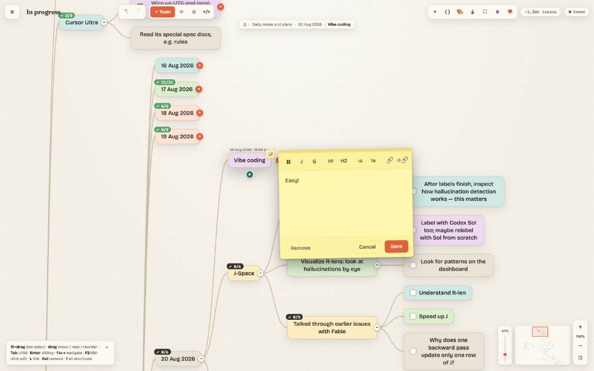

# Roc Mind Spark

[English](README.md) · [中文](README.zh.md)

macOS **原生浮层**思维导图。任意 App、任意桌面、任意全屏 Space 上按快捷键，导图盖在当前画面上。记完收起，继续干活。不用去找浏览器标签，也不用切 Space。

画布来自 Prasad Patil 的 [MindSpark](https://github.com/prasadpatil25/MindSpark)（MIT）。Roc Mind Spark 用 Swift / AppKit / WKWebView 包了一层壳，让它像系统浮层，而不是一个网页。

<p align="center">
  
</p>

**目前只有 macOS 14+。** 不管 Windows。

## 为什么要做成浮层

Vibe coding 一天会在编辑器、模型、论文、终端之间跳。贵的不是打字，是线索断掉。离开一个界面之前按快捷键，把「现在卡在哪、刚弄明白什么、下一步跑什么」丢到图上。一天下来图就是日志，不用从聊天记录里反推下午干了什么。

科研同理。浮层盖住当前 Space，看论文、看 GPU 面板、写代码时都能记，不用切走。

## 唤出

默认快捷键：**⌃⌥⇧⌘Q**。如果你把 Caps Lock 映射成 Hyper（Command + Control + Option + Shift），那就是 **Caps + Q**。

这组键比较满，故意少跟当前 App 打架——**到设置里改**（工具栏齿轮，或浮层打开时按 **⌘,**）。菜单栏图标也有显示 / 隐藏。

点菜单栏、Dock 或另一块屏幕会收起。Escape 留给画布（取消编辑），不会关浮层。

## 操作

| 操作 | 作用 |
|---|---|
| 画布上 **⌘ + 拖拽** | 框选节点 |
| **⌘ + 点击** | 把节点加入 / 移出多选 |
| **拖拽** 节点 | 移动（子树跟着走） |
| **丢到另一个节点中心** | 变成它的子节点 |
| **丢到上 / 下边缘** | 插入同级或排序 |
| **Tab** | 子节点 |
| **Enter** | 同级节点 |
| **↑ ↓ ← →** | 移动选中 |
| **F2** 或双击 | 编辑 |
| **L** | 连到另一个节点 |
| **Delete** | 删除 |
| **Space** | 折叠 / 展开 |
| **?** | 全部快捷键 |

滚轮缩放，拖空白处平移。任意工具栏按钮上右键可以绑自定义快捷键。

## 语言

设置 → **Language**：English 或 中文。**默认英文。** 侧栏、设置、菜单栏跟这个选项走。图里你自己写的字不会被翻译。

## 从源码安装

需要 **macOS 14+**、**Xcode / Swift 6**、**Node 22+**（浮层会在本地拉起原来的 MindSpark 服务，运行时不用 `npm install`）。

```bash
git clone https://github.com/RocStone/roc-mind-spark.git
cd roc-mind-spark
make install
```

编完会把 App `mv` 进 `/Applications/Roc Mind Spark.app`。目录写不了时终端会要密码。装完浮层会自己打开。

图存在 `~/Library/Application Support/RocMindSpark/`。

```bash
make test    # 画布单测
make clean
```

## 致谢

Roc Mind Spark **基于 [MindSpark](https://github.com/prasadpatil25/MindSpark)**，作者 [Prasad Patil](https://github.com/prasadpatil25) 与贡献者。编辑器、布局、Markdown 模式、模板、本地 SQLite 服务都是他们的。这个仓库加的是 macOS 浮层、全局快捷键、应用内语言切换，以及打包。

只想在浏览器里用思维导图，去上游 MindSpark。想在 Mac 上随时唤出一层原生浮层，用这个 fork。

## 许可

[MIT](LICENSE) —— 与 MindSpark 相同。见 [NOTICE](NOTICE)。
